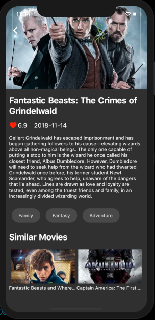

# Flutter Movies

Movies app 🎥 which is developed using Flutter and powered by tmdb api. It follows bloc architecture pattern and Inherited Widget.
This project was made for learning the bloc architecture pattern and Inherited Widget. 

# Screenshot

| Movie List Screen | Movie Detail Screen |
| ------------------ | ------------------ |
|   |   |

 

